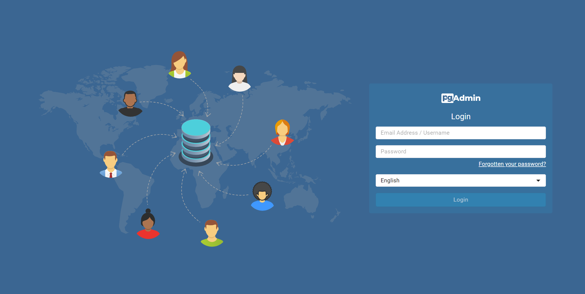

# Deploy PostgreSQL PgAdmin Guide

**(also provided Traditional Chinese version document [README-CH.md](README-CH.md).)**

deploy PostgreSQL and PgAdmin by docker.  

## Overview
- Database: PostgreSQL v13.2

## Run
edit `PGADMIN_DEFAULT_EMAIL` as your own email in docker-compose.  
```
docker compose up -d
```

Datebase is running at `localhost:5432`  
UI is running at `http://localhost:8080`  


## UI

